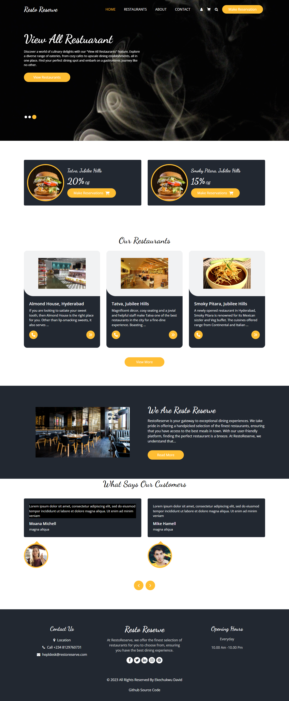
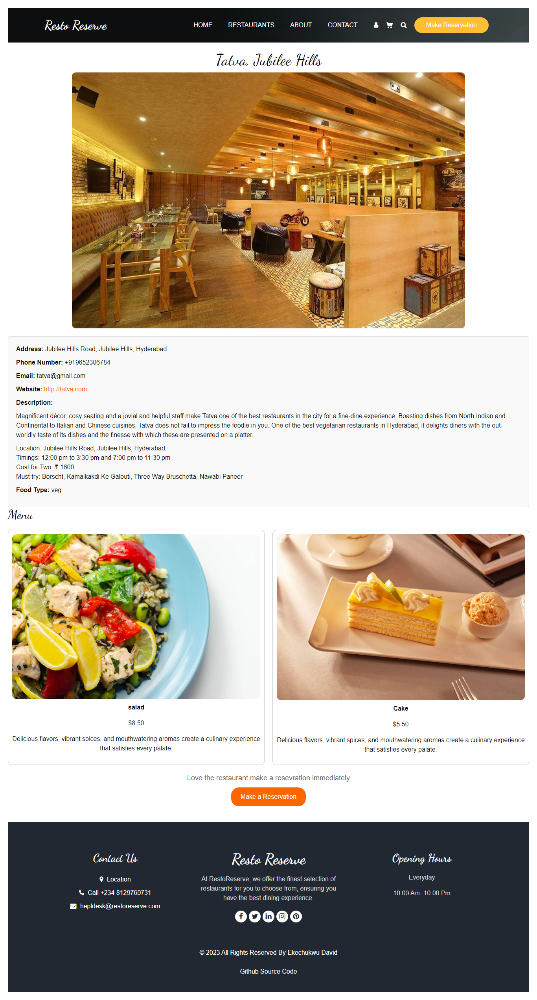
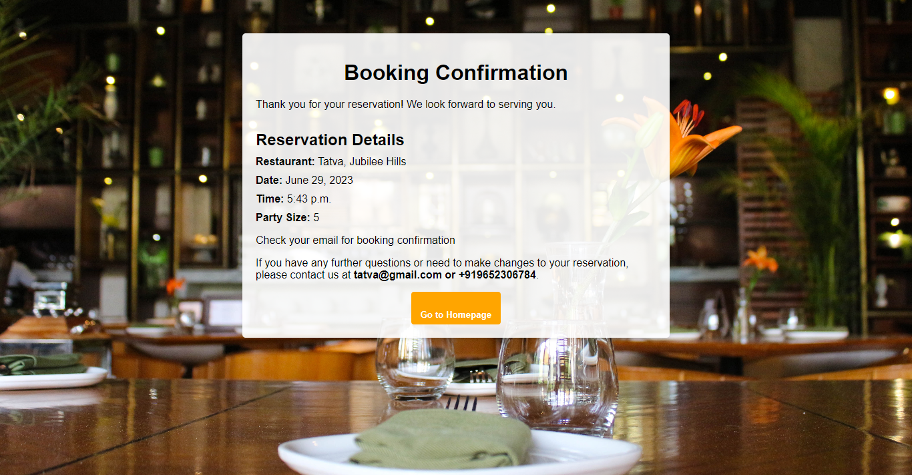

# RestoReserve

## RestoReserve: Discover the Best Dining Experiences
RestoReserve is a modern and user-friendly restaurant reservation booking web application. It aims to provide a seamless experience for users to discover, explore, and book reservations at their favorite restaurants. With a sleek and intuitive interface, RestoReserve makes it effortless for users to find the perfect dining spot and secure their reservations hassle-free.

RestoReserve is your gateway to exceptional dining experiences. We take pride in offering a handpicked selection of the finest restaurants, ensuring that you have access to the best meals in town. With our user-friendly platform, finding the perfect restaurant is a breeze.

At RestoReserve, we understand that everyone has unique preferences when it comes to dining. That's why we curate a diverse range of culinary destinations, catering to various tastes and dietary preferences. From cozy cafes to upscale fine dining establishments, we have something to satisfy every craving.

Our mission is to make your dining journey seamless and enjoyable. With just a few clicks, you can explore restaurant profiles, browse menus, check availability, and make hassle-free reservations. We are dedicated to providing you with a convenient and personalized booking process, allowing you to focus on savoring every moment.

Join us on a gastronomic adventure and indulge in memorable dining experiences. RestoReserve is more than just a booking platform; we are your trusted companion in discovering hidden gems and creating cherished memories. Let us guide you to the best restaurants in town, where delectable flavors await. Welcome to RestoReserve, where we bring together the joy of exceptional dining and the art of unforgettable meals.

## Features

- **Browse Restaurants:** Users can view a comprehensive list of available restaurants, along with essential details such as name, address, contact information, and website.
- **Reservation Booking:** The platform offers a streamlined reservation booking process where users can select a restaurant, choose their desired date and time, and specify the party size for their booking.
- **Confirmation Message:** Upon successfully making a reservation, users receive a confirmation message that assures them of their booking and provides all the necessary details.
- **Email Notifications:** RestoReserve also sends email notifications to users, ensuring they have all the reservation information handy, including restaurant name, date, time, and party size.
- **Restaurant Details:** Users can explore comprehensive information about each restaurant, including enticing menus, vibrant images, and additional descriptions, allowing them to make informed decisions.
- **Responsive Design:** RestoReserve is built with a responsive design, ensuring optimal user experience across various devices, including desktops, tablets, and mobile phones.

## Screenshots

Here are some screenshots to give you a glimpse of RestoReserve:

*Homepage - Discover and browse available restaurants.*

*Restaurant Details - Explore detailed information about a specific restaurant.*

*Booking Confirmation - Receive a confirmation message after making a reservation.*

## Technologies Used

RestoReserve utilizes the following technologies:

- **Django:** Python-based web framework for efficient and scalable development.
- **HTML/CSS:** Markup and styling for creating visually appealing web pages.
- **JavaScript:** Enhancing user interactivity and implementing dynamic features.
- **PostgreSQL:** Robust and reliable database management system for storing restaurant and reservation data.

## Installation

To run RestoReserve locally on your machine, follow these steps:

1. Clone the repository: `git clone https://github.com/username/restoreserve.git`
2. Navigate to the project directory: `cd restoreserve`
3. Install the project dependencies: `pip install -r requirements.txt`
4. Set up the database and apply migrations: `python manage.py migrate`
5. Start the development server: `python manage.py runserver`
6. Access RestoReserve in your web browser at: `http://localhost:8000`

## Contributing

Contributions are welcome! If you'd like to contribute to RestoReserve, please follow these guidelines:

1. Fork the repository.
2. Create a new branch.
3. Make your changes and commit them with descriptive messages.
4. Push your changes to your forked repository.
5. Submit a pull request.

## License

RestoReserve is licensed under the .....

## Acknowledgments

We would like to express our gratitude to the following resources for their invaluable support and inspiration during the development of RestoReserve:

- [Unsplash](https://unsplash.com/) for providing stunning and high-quality images used in the project.
- [Django Documentation](https://docs.djangoproject.com/) for the comprehensive and reliable documentation on Django web framework.
- [Bootstrap](https://getbootstrap.com/) for the responsive CSS framework that helped in building the user interface.

You can visit the live page of RestoReserve [here](https://resto-reserve.vercel.app/).

Enjoy using RestoReserve and have a delightful dining experience at your favorite restaurants!
